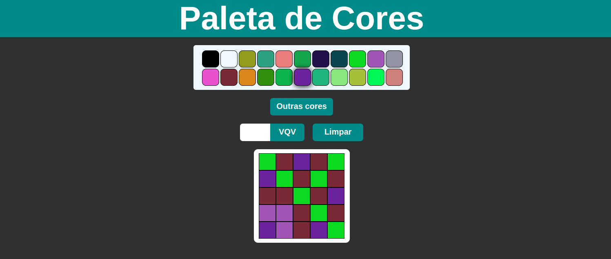

# project-pixels-art

## Sobre o Projeto

Projeto que realizei na Trybe. Um projeto que tem como objetivo criar uma paleta de cores onde o usuário pode escolher a cor desejada para realizar se desenho. Esse projeto tem também como objetivo fixir os aprendizados sobre o DOM alem de buscar novos conhecimentos.

(<a href="#readme-top">back to top</a>)

## Construido Com
 1. **HTML**
 2. **CSS**
 3. **JavaScript**
 3. **DOM**

(<a href="#readme-top">back to top</a>)

## Uso

(<a href="#readme-top">back to top</a>)

## Contato

Renan Fernandes - [Linkedin](https://www.linkedin.com/in/orenanfernandes/)

(<a href="#readme-top">back to top</a>)

