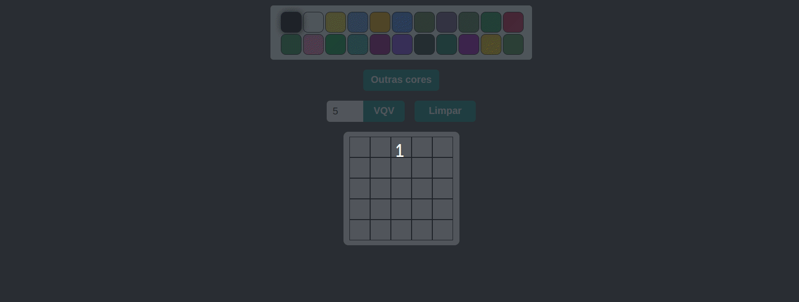

# project-pixels-art

## Sobre o Projeto

Projeto que realizei na Trybe. Um projeto que tem como objetivo criar uma paleta de cores onde o usuário pode escolher a cor desejada para realizar se desenho. Esse projeto tem também como objetivo fixir os aprendizados sobre o DOM alem de buscar novos conhecimentos.

(<a href="#readme-top">voltar ao topo</a>)

## Construido Com
 1. **HTML**
 2. **CSS**
 3. **JavaScript**
 3. **DOM**

(<a href="#readme-top">voltar ao topo</a>)

## Uso

A pessoa usuária pode selecionar uma cor na paleta e pintar o quadro, também pode limpar o quadro clicando no botão "Limpar"

A pessoa usuária pode alterar o tamanho do quadro, selecionando um valor no input e depois clicar no botão "vqv" para confirmar.

A pessoa usuária pode gerar novas cores clicando no botão "Outras cores".

(<a href="#readme-top">voltar ao topo</a>)

## Contato

* Renan Fernandes - [Linkedin](https://www.linkedin.com/in/orenanfernandes/) - renzinestuods@gmail.com

(<a href="#readme-top">voltar ao topo</a>)

## Agradecimentos

* [Trybe](https://www.betrybe.com/)

(<a href="#readme-top">voltar ao topo</a>)

